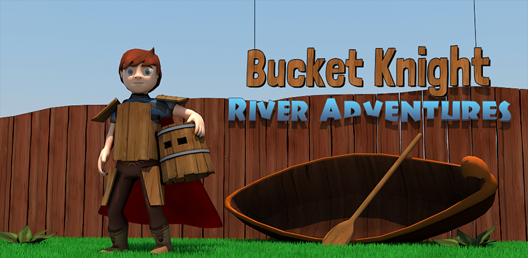

# Custom camera Demo

Base game was forked from [Trollpants repository](https://github.com/jizc/Trollpants/tree/8c5d817b685cb68be5788f9dc008ac74974221ae/BucketKnight).

This demo demonstrates Custom camera functionality of the Voximplant Unity SDK.
It allows to send video from Unity Camera to popular streaming services like Youtube and Twitch.

## Features

The application is able to:

- log in to the Voximplant Cloud
- attach to Unity Camera
- send in game video to selected streaming service

## Instructions

Check [Streaming Introduction](https://voximplant.com/docs/tutorials/streaming-introduction) article for detailed setup.

## Installing

1. Clone this repo
2. Install Voximplant Unity SDK from [GitHub Releases](https://github.com/voximplant/unity_sdk/releases)
3. Enter valid credentials at [Vox.cs](Assets/Scripts/Vox.cs#L107)

## Original readme

### Bucket Knight: River Adventures

Bucket Knight: River Adventures is an endless rafting mobile game created in [Unity](http://unity3d.com/) by a team of interns at [Trollpants Game Studio](https://github.com/jizc/Trollpants) in 2015.

### Release History

Bucket Knight: River Adventures was released on Google Play, Apple App Store and Amazon Appstore on May 13th, 2015.

### CloudOnce

[CloudOnce](https://github.com/jizc/CloudOnce) was used to implement [Google Play Game Services](https://developers.google.com/games/services/) and [Apple Game Center](https://developer.apple.com/game-center/).

### License

The contents of this project is licensed under the MIT license, unless other is specified in file header. See [LICENSE file](./LICENSE) in the project root for full license information.
